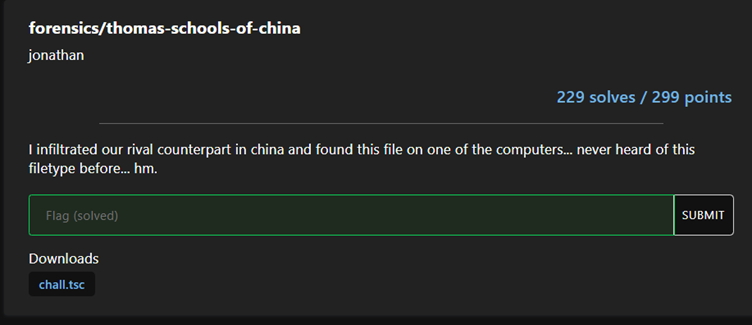
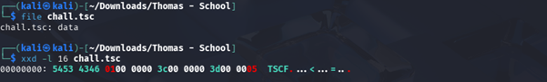
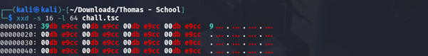
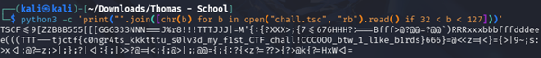

# CTF Write-up: Thomas School of China

## Overview
This challenge involved the recovery of a hidden flag from a custom-formatted binary file (.tsc). The objective was to perform file signature identification, manual header analysis, and data sanitization to retrieve the embedded plaintext flag.

The challenge provided an unfamiliar file format, requiring the investigator to bypass obfuscation layers to recover the hidden artifact and reconstruct the flag.

## Description
I infiltrated our rival counterpart in china and found this file on one of the computers... never heard of this filetype before... hm.

## Strategy
* **Header Verification**: Identified the non-standard TSCF header.
* **Obfuscation Analysis**: Investigated injected noise (kkktttu, CCCOOO, 666}).
* **Data Sanitization**: Cleaned the output to reveal the flag.

## Solving Steps

### 1. Signature Identification

Used `file` and `hexdump` to identify the non-standard header.
This image confirms the initial reconnaissance. By running the file command, I demonstrated that the binary lacks a standard file signature (returning only 'data'), which immediately alerted me to the presence of an obfuscation layer."

This screenshot highlights the hex header analysis. Identifying the 'TSCF' magic bytes provided the specific evidence needed to categorize this as a custom, non-standard container rather than a corrupted file

### 2. Artifact Extraction

Used `dd` to strip the header and expose the binary stream.
This captures the header-stripping process. Using dd, I bypassed the 4-byte obfuscation header. This critical step was required to expose the underlying data structure, which was inaccessible as long as the custom header remained in place

This shows the result of the extraction. By verifying the binary stream following the header removal, I confirmed that the file contained hidden, obfuscated plaintext, effectively isolating the flag-bearing artifact."

### 3. Sanitization

This final image displays the raw extracted output before sanitization. It visualizes the 'noise'—the injected kkktttu, CCCOOO, and 666} padding—that I identified as intentional obfuscation. This provides visual proof of the noise patterns that needed to be cleaned to recover the valid flag string.

Filtered out the repeated junk patterns to recover the plaintext.

## Final Flag
tjctf{c0ngr4ts_u_s0lv3d_my_f1st_CTF_chall!_btw_1_l1ke_b1rds}
