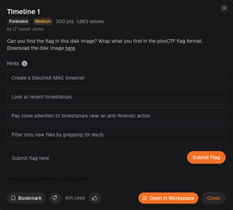
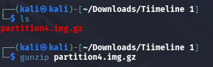
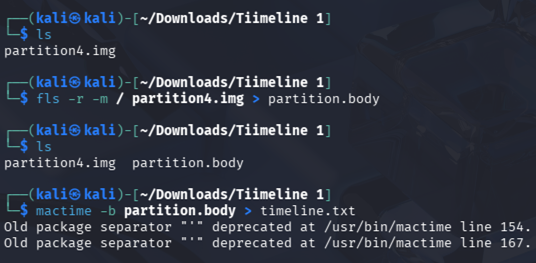
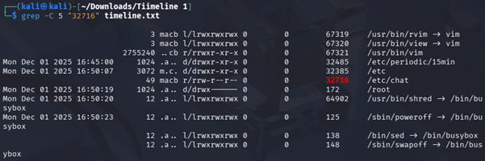
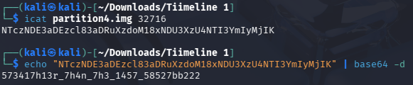

# CTF Write-up: Timeline 1 (Forensics)

## Overview
This challenge involves the forensic analysis of a disk image to recover a hidden flag. The objective is to utilize SleuthKit to reconstruct historical file system activities and identify evidence of unauthorized or suspicious user behavior.

The challenge presents a compressed disk image that requires careful investigation to locate a specific hidden artifact. The final extracted data must be formatted according to the picoCTF flag structure to be accepted.

##Description
"Can you find the flag in this disk image? Wrap what you find in the picoCTF flag Format"

## Strategy
* **Timeline Creation**: Used SleuthKit to track file system modifications.
* **Temporal Correlation**: Analyzed timestamps near anti-forensic actions.
* **Data Filtering**: Used grep to isolate relevant artifacts.

## Solving Steps
My methodology focused on establishing a controlled environment for evidence, followed by a targeted, hypothesis-driven search of system configuration paths.

### 1. Decompression

`gunzip partition4.img.gz`
first decompressed the disk image (partition4.img.gz) to extract the raw binary data, which is a prerequisite for file system parsing.

### 2. Timeline Analysis

`fls -r -m / partition4.img > body.txt`
`mactime -b body.txt > timeline.txt`
I executed fls to enumerate files and mactime to construct a chronological metadata timeline. This transformed raw file system data into an indexed, human-readable format.

### 3. Searching
Performed a directory-level sweep of /etc/. This revealed Inode 32716 as a high-priority artifact.

Rather than an unstructured search, I performed a directory-level sweep of /etc/. Configuration directories are high-priority forensic targets for identifying persistence or tampered services. This revealed Inode 32716 as a significant outlier. 

To confirm the relevance of Inode 32716, I utilized grep -C 5 to view the activity window. The file access occurred at 16:50:07, only 16 seconds prior to the poweroff command, strongly indicating an intentional anti-forensic attempt.

### 4. Extraction

`icat partition4.img 32716`
I extracted the artifact using icat and identified it as Base64 encoded. I then decoded the content to reveal the final flag.

## Final Flag
picoCTF{573417h13r_7h4n_7h3_1457_58527bb222}
